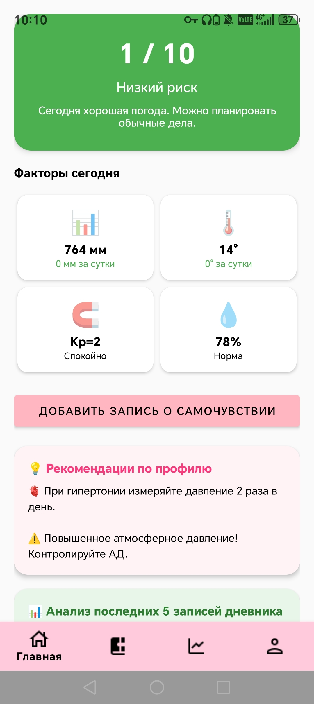
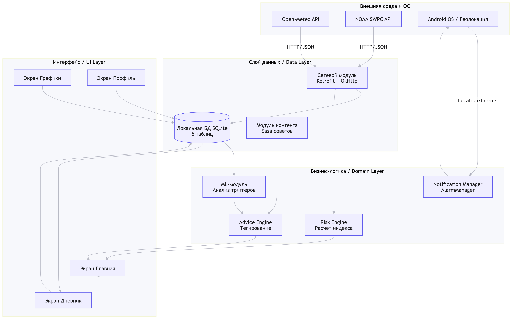

# MeteoHelper

Мобильное приложение для анализа метеозависимости и контроля самочувствия.

---

## Назначение

**MeteoHelper** предназначено для информирования пользователей о влиянии погодных и геомагнитных факторов на самочувствие. Приложение рассчитывает индивидуальный индекс риска, ведёт дневник самочувствия и формирует персонализированные профилактические рекомендации.

Документация предназначена для пользователей приложения, а также для специалистов по внедрению и техническому обслуживанию.

---

## Основные возможности

- Просмотр текущих погодных показателей (температура, давление, влажность, Кр-индекс);
- Расчёт индекса риска с цветовой индикацией (зелёный / жёлтый / красный);
- Ведение дневника самочувствия с выбором симптомов;
- Просмотр графиков изменения атмосферного давления и температуры;
- Ежедневные push-уведомления в 07:55;
- Персонализированные рекомендации на основе дневника (ML-модуль).

---

## Документация

- [Быстрый старт](quick-start.md) — как начать работу за 5 минут;
- [Установка и настройка](installation.md) — требования и установка APK;
- [Руководство пользователя](user-guide.md) — основные операции;
- [Справочная информация](reference.md) — параметры, разрешения, таблицы;
- [FAQ](faq.md) — частые вопросы и решение проблем.

---

## Интерфейс программы

*Рисунок 1 — Главный экран приложения с индексом риска.*

---

## Архитектура приложения

*Рисунок 2 — Схема структуры приложения.*

---

**Разделы документации:**

[Главная](index.md) | [Быстрый старт](quick-start.md) | [Установка](installation.md) | [Руководство](user-guide.md) | [Справка](reference.md) | [FAQ](faq.md)

---

[← Вернуться на главную](index.md)